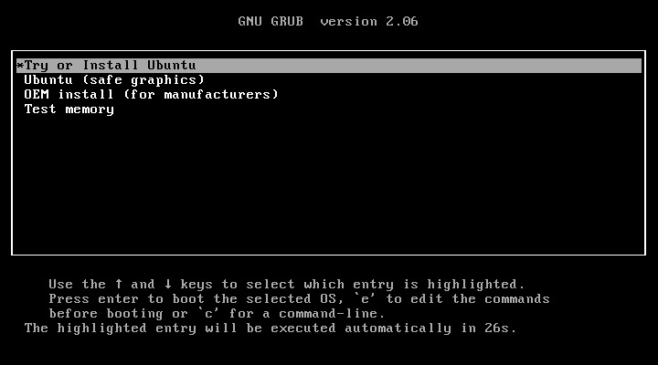
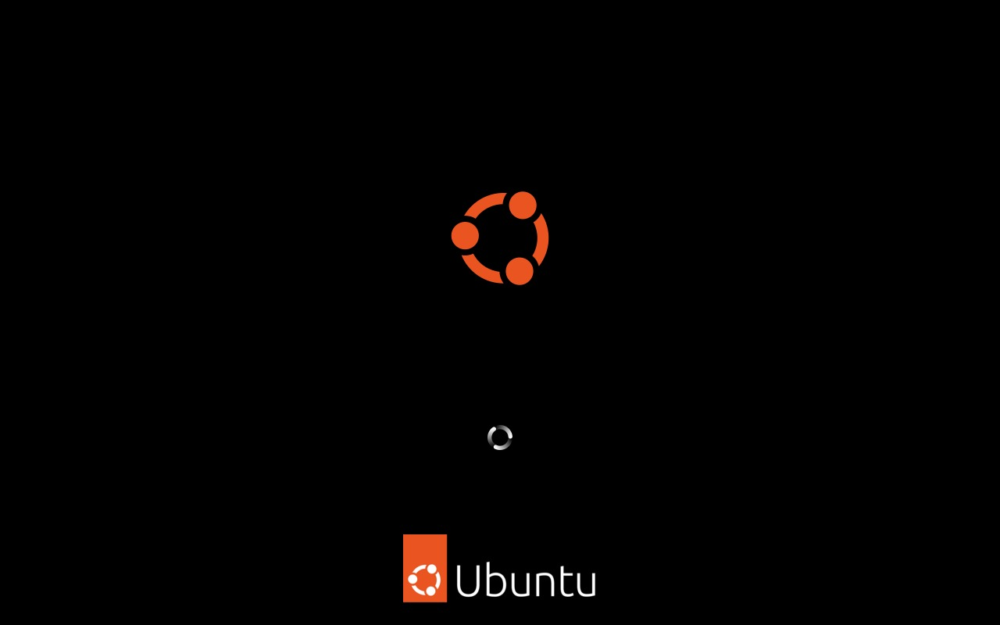
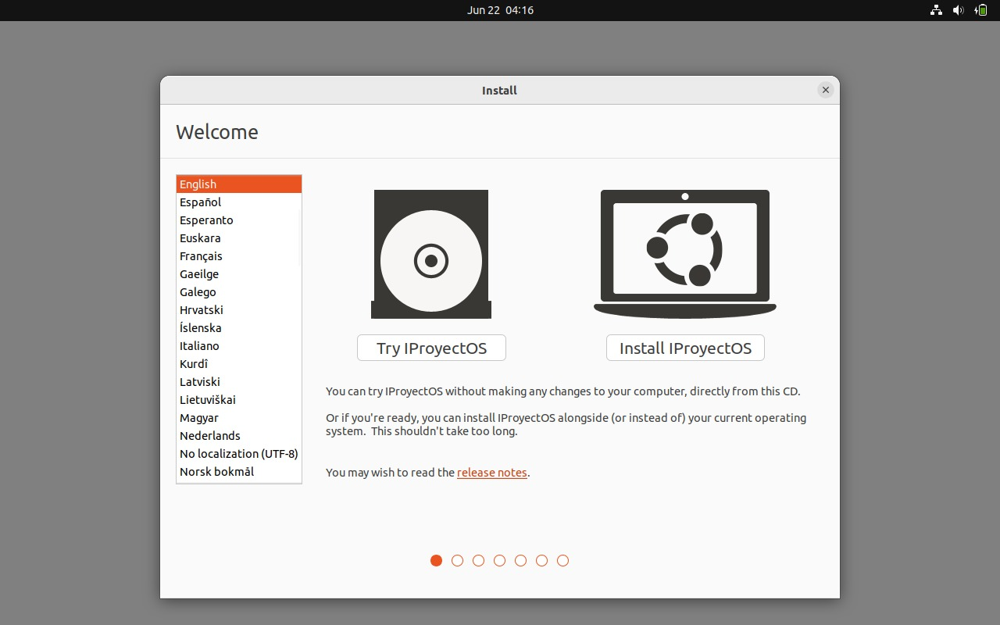
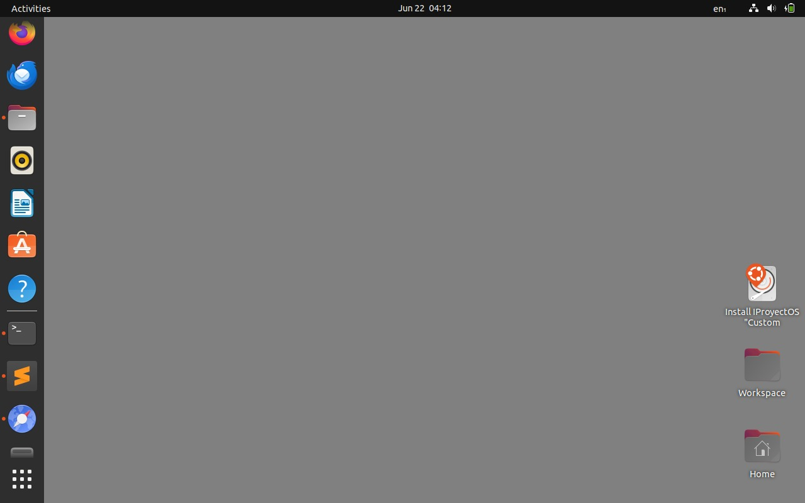
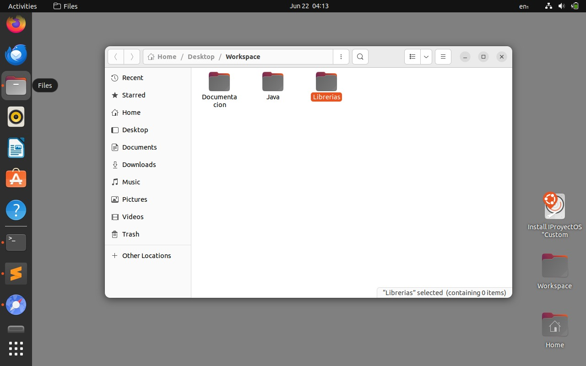
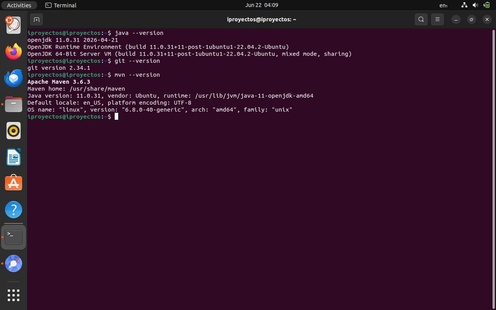
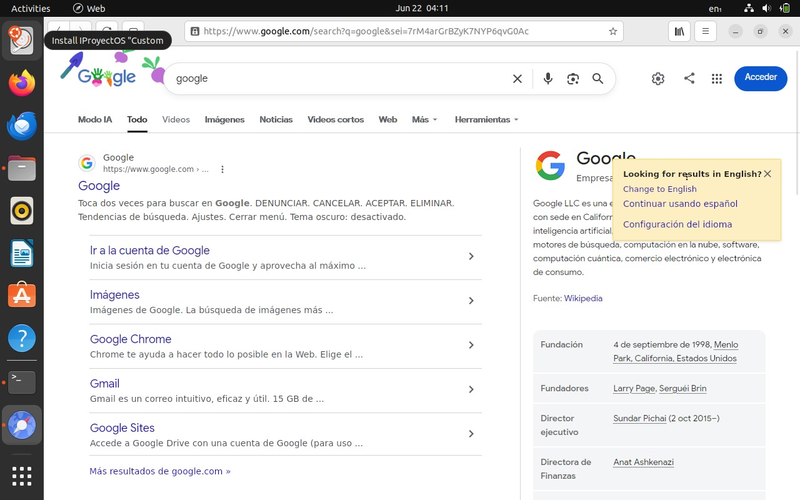

# Integrative-Project-Build-Boot-and-Attack
Repo for the final integrative project: 

**· Your own distro (Cubic)**

**· A 64-bit kernel from scratch**

**· Offensive lab (Black Hat Bash)**

**Members:** Mateo Charro, Danna Simaluisa and Camila Villagran

# IProyectoOS - Custom ISO

**Student in charge:** Danna Simaluisa  

## 1. ISO File and Checksum

* **Download Link (ISO):** https://drive.google.com/file/d/1bWEIvT50bOfuw1izkBG_DmRJjBa3dyTb/view?usp=sharing
* **File Integrity (SHA256 Checksum):**

```
Algorithm: SHA256
Hash:                                                           962D1AEE5172DBDB09C876E6DBE6685A8DE12A684EB2B6027E5D7AB8D864BD96 
```

## 2. Base System Used

* **Base Distro:** Ubuntu 22.04 LTS (Jammy Jellyfish).
* **ISO editing tool:** Cubic (Custom Ubuntu ISO Creator).
* **Base Justification:** Version 22.04 LTS was selected due to its proven stability and native compatibility of its bootloader in the initramfs phase with type 2 hypervisors (VirtualBox/QEMU), evading the UUID loss conflicts presented by more recent kernels.

## 3. List of Modifications and Justification

Below are the persistent modifications injected into the ISO's file system during the packaging phase:

### Modification 1: Java Environment Deployment and Version Control
* **Action:** Installation of the default-jdk (OpenJDK 11), maven (v3.6.3), and git (v2.34.1) packages.
* **Justification:** This was done to provide the distribution with the necessary compilation, dependency management, and version control tools so that the environment is ready for native software development with the Java programming language.

### Modification 2: Code Editor Integration
* **Action:** Addition of security GPG keys, configuration of the external official repository in /etc/apt/sources.list.d/, and installation of Sublime Text.
* **Justification:** It serves to complete the environment created for programming with a secure text editor, ensuring that the developer receives direct and secure updates from the official provider, minimizing resource consumption.

### Modification 3: Web Browser Replacement
* **Action:** Integration of GNOME Web (epiphany-browser).
* **Justification:** It was downloaded to include a native open-source browser from the GNOME desktop environment, which is lighter for local development tests in a virtualized environment.

### Modification 4: Workspace Structuring (User Skeleton)
* **Action:** Creation of the directory structure Desktop/Workspace/Java, Desktop/Workspace/Librerias, and Desktop/Workspace/Documentacion within /etc/skel.
* **Justification:** This modification seeks to standardize a persistent folder architecture. Any new user who logs in will automatically inherit this organized work environment on their desktop.

### Modification 5: Persistent Visual Customization
* **Action:** Modification of GNOME schemas through the 99-custom-theme.gschema.override file to override native images and set the primary color to #808080 (gray).
* **Justification:** It gave the OS a neutral visual environment (solid gray) by default that reduces visual fatigue and minimizes video memory consumption in emulators.


## 4. Video Demonstration

* **Demonstration Video Link:** https://drive.google.com/file/d/1mzlgn_TPkWyfhenXPINP5tCAWyL25QYZ/view?usp=sharing

The video demonstrates the successful booting of the ISO and the functioning of the pre-installed tools.

## 5. Screenshots 

### System Boot 




### Custom Graphical Environment 



### Operational Development Tools


### Open Source Web
