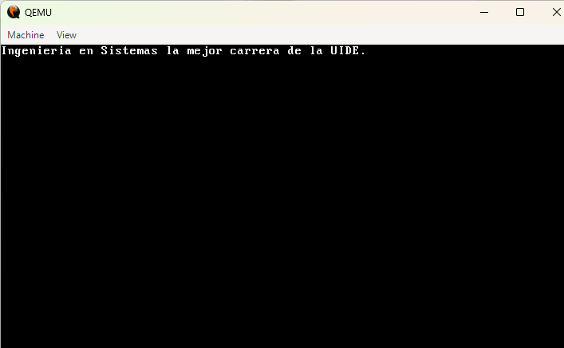

# PART 2 — A 64-bit Kernel From Scratch

**Student in charge:** Mateo Charro

This section contains the source code, Docker environment configuration, and automation tools required to compile and deploy a 64-bit micro operating system from scratch. The kernel is compatible with the Multiboot2 standard, performs the critical transition from 32-bit mode to Long Mode (64-bit), and communicates directly with the video hardware to print a custom message on the screen without relying on standard libraries.

---

## 1. Deliverables: ISO File & Video Demonstration

* **Download Link (ISO):** [Insert Google Drive / OneDrive link here]
* **File Integrity (SHA256 Checksum):** `[Insert the hash generated via Get-FileHash here]`
* **Video Demonstration (≤ 2 min):** [Insert YouTube / Drive link here]
  > *Note: The video showcases the kernel building process and its successful bare-metal boot in QEMU.*

---

## 2. Reproducible Development Environment

To avoid dependency conflicts and ensure that the code compiles exactly the same on any machine, an isolated cross-compilation environment was implemented using Docker.

* **Build Container (`Dockerfile`):** Based on Ubuntu, it includes essential low-level development tools such as `gcc cross-compiler`, `nasm`, and the linker.
* **Boot Hang Prevention:** To ensure that the final ISO image is recognized as a valid bootable disk by BIOS/UEFI systems, the image includes critical utilities such as `xorriso`, `grub-pc-bin`, and `grub-common`.
* **Automation (`Makefile`):** A control file was designed to automatically chain the tasks of compilation, linking, and operating system packaging into a single command.

---

## 3. System Architecture and Repository Structure

The kernel structure is divided into modular components within the `src/` and `targets/x86_64/` directories, completing the "Episode 2" full credit requirements:

| Component | Function |
| :--- | :--- |
| **Multiboot2 & CPUID** | `header.asm` defines the Multiboot2 header required by GRUB. The assembly code verifies Multiboot, CPUID, and Long Mode support. |
| **Paging & GDT** | Sets up identity-mapping for the first GB with huge pages and builds a 64-bit Global Descriptor Table (GDT) to perform the transition from the native 32-bit boot environment. |
| **C Logic (`kernel.c`)** | Jumps to `long_mode_start` and links in C code. Since standard libraries are unavailable, it includes custom print functions (`clear`, `set_color`, `print_str`) writing directly to VGA video memory at physical address `0xb8000`. |
| **Linker & GRUB** | `linker.ld` controls the binary memory layout. `grub.cfg` instructs GRUB to boot the kernel using `grub-mkrescue` to generate `kernel.iso`. |

---

## 4. Build and Execution Instructions (One-Liner)

Thanks to the automation provided by the `Makefile` and Docker, creating the operating system image is reduced to a single command. Run it from the project root directory:

    docker run --rm -v $(pwd):/root/env <your_docker_image_name> make clean all iso

*(Once compiled, the kernel can be emulated using `qemu-system-x86_64 -cdrom kernel.iso`)*

---

## 5. Execution Evidence

### Bare-Metal Boot (QEMU)
